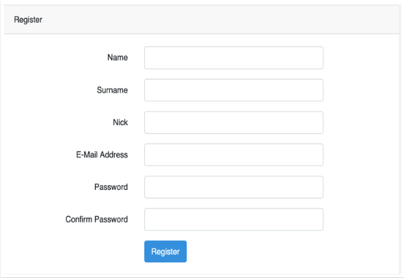

# Proyecto: Instagram Laravel
En este proyecto vamos a implementar un Instagram utilizando el framework de Laravel
Los pasos para seguir son los siguientes:
1. Crear proyecto y diseñar base de datos
2. Migraciones, modelos y seeders
3. Login y registro de usuario
4. Configuración de usuarios
5. Imágenes de la aplicación
6. Sistema de comentarios con edición y borrado de imágenes
7. Sistema de likes
8. Perfiles de usuarios
9. Gente y buscador

## 1. Crear proyecto y diseñar base de datos 
- La base de datos se llamará `instagram`
- Creamos nuestro proyecto en Laravel utilizando composer
- Configuramos laravel para acceder la base de datos
- Diagrama ER de la BD:  

## 2. Migraciones, modelos y seeders
- Crear 3 migraciones para cada una de las tablas en el siguiente orden (images comments, likes) para que no haya problemas con las claves foráneas.
- La migración Users ya esta creada, modifícala para añadir el campo image que pueda ser null.
- Crea los 3 modelos en singular (Image, Comment, Like). El modelo User ya está creado.
- Implementa las relaciones 1:M que localices en el modelo usando los métodos hasMany y belongsTo correspondientes.
- Crea seeders para insertar datos en todas las tablas.
## 3. Login y registro de usuario
- Este debería ser el formulario de registro:  
  
- Es necesario ajustar el modelo User.php (recordad incluir en $fillable los atributos añadidos)
- Además es necesario modificar el método validator de la clase RegisterController para validar los atributos añadidos
- Vamos a intentar que la aplicación responda con la página principal en / (eliminando /home y /welcome de las rutas predefinidas)
- Para conseguirlo hay que modificar el lugar donde redirige tras un login exitoso (atributo redirectTo de la clase RegisterController)
## 4. Configuración de usuarios
- Usando la distribución de la página principal predefinida esta sería la barra de navegación:  
  
- Destacar la opción de configuración del usuario, donde se podrá asociar un avatar al usuario:  
  

## 5. Imágenes de la aplicación
- Para dar de alta una imagen:  
  
- El listado de imágenes debe estar paginado y con el siguiente formato:
  
- Las imágenes pueden ser visualizadas por cualquier usuario registrado, pero sólo podrá borrarlas el usuario que la creó.
- Importante mostrar un diálogo modal para confirmar el borrado de imágenes:  
  

## 6. Sistema de comentarios con edición y borrado de imágenes
- Los usuarios pueden añadir comentarios (no hay límite) a las imágenes:  
  
- Los comentarios solo pueden ser eliminados por el usuario que creó la imagen o por el usuario que ha comentado.

## 7. Sistema de likes
- Al pulsar sobre el icono de likes de una imagen se cambia el estado de like por parte del usuario correspondiente.
- Esta interacción se llevará a cabo con una petición AJAX y se cambiará el color del icono al cambiar de estado.
- No puede hacer like el usuario que crea la imagen.
- Junto al icono de likes debe aparecer el total de likes que ha recibido la imagen.
- La opción Favoritas del menú de navegación mostrará el listado (paginado) de las imágenes en las que el usuario haya marcado like.

## 8. Perfiles de usuario
- El perfil de un usuario consiste en el listado (paginado) de imágenes que ha creado.
  

## 9. Gente y buscador
- El apartado Gente nos mostrará un listado de todos los usuarios del sistema.
- Además de un buscador que mostrará los usuarios que contenga la palabra clave en el nick, nombre o apellido.
- El botón Ver Perfil nos mostrará todas las fotos subidas por ese usuario.
  
